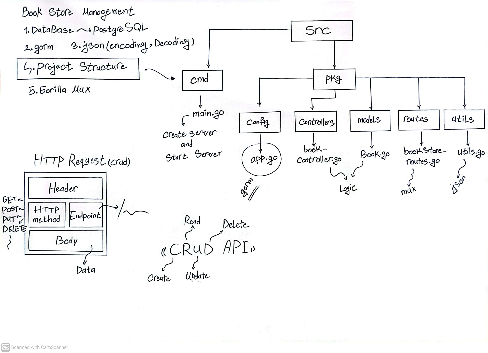
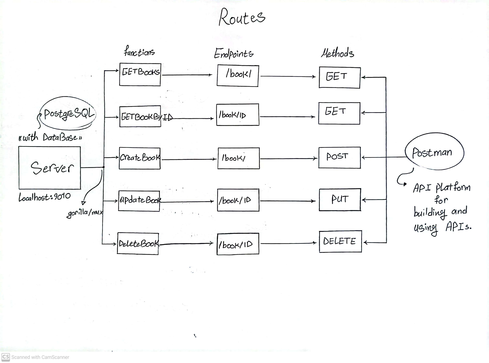

# book-management-system-sql-crud-api

⚠️ **NOTE!!!!!** This Goalng App Written for Me - So some Things Might not Work on Your PC or Laptop as this was Never Intended to be a Usable Full Fledged Application, in that Case, Please Try if You Can Fix that Up as Much as Possible, or you can Open an Issue for Help :) - You Need to Change Something Related to Database (in Makefile, docker-compose.yml, gorm and ...) - So Please Check Everything Before Running the Database and Server.




## Requirements

- make
- [PostgreSQL](https://www.postgresql.org/)
- [PostgreSQL Docker Image](https://hub.docker.com/_/postgres)
- Create a Docker Network to Connect Golang Server Container and PostgreSQL Container with Each other

## Makefile

A Standard GNU Make File is Provided to Help with Running and Building Locally.

```text
help                 💬 This Help Message
lint                 🔎 Lint & Format, will not Fix but Sets Exit Code on Error
lint-fix             📜 Lint & Format, will Try to Fix Errors and Modify Code
build                🔨 Build Binary File
run                  🏃 Run the Web Server Locally at PORT 8080
init                 📥 Download Dependencies From go.mod File
clean                🧹 Clean up Project
postgres             📚 Pull PostgreSQL Docker Image from Docker Hub Registry
docker-network       🪡 Create Docker Network
image                📦 Build Docker Container Image from Dockerfile
push                 📤 Push Container Image to Registry
compose-up           🧷 Create and Start Containers
compose-down         🧼 Stop and Remove Containers, Networks
```

Makefile Variables

| Makefile Variable | Default                                          |
| ----------------- | ------------------------------------------------ |
| SRC_DIR           | ./src/                                           |
| DEFAULT_GOAL      | help                                             |
| BINARY_NAME       | main                                             |
| BINARY_DIR        | ./bin/                                           |
| IMAGE_REPO        | soelz/golang-book-management-system-sql-crud-api |
| IMAGE_TAG         | 0.1                                              |
| DATABASE_URL      | postgres://gorm:1234@db:5432/bank                |
| PostgreSQL_IMAGE  | postgres:alpine3.18                              |

## DataBase (PostgreSQL)

PostgreSQL Configurations Available in [./src/pkg/config/app.go](src/pkg/config/app.go).

## Containers

RUN Server in a Container

```bash
docker run --name db --network backend -e POSTGRES_USER=gorm -e POSTGRES_PASSWORD=1234 -e POSTGRES_DB=bank -p 5432:5432 postgres:alpine3.18
```

```bash
docker run --network backend -e DATABASE_URL=postgres://gorm:1234@db:5432/bank -p 9010:9010 soelz/golang-book-management-system-sql-crud-api:0.1
```

OR

Just Execute this Command ~>

```bash
make compose-up
```

<br></br>
